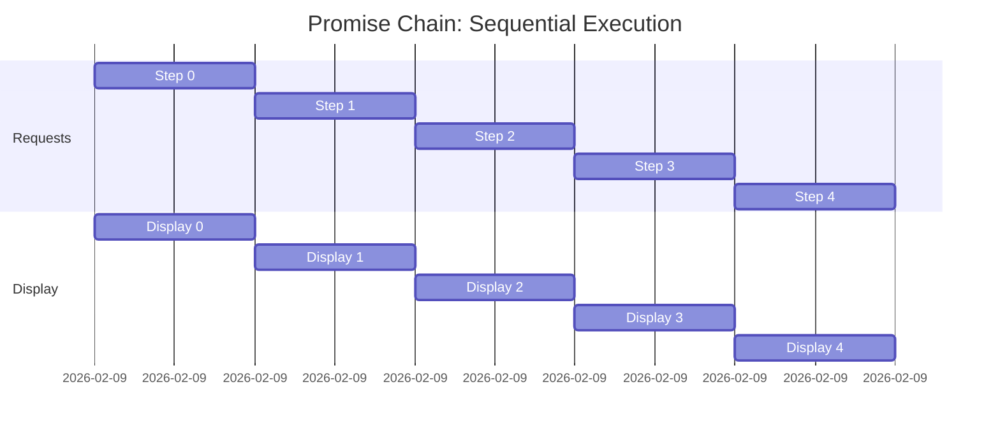
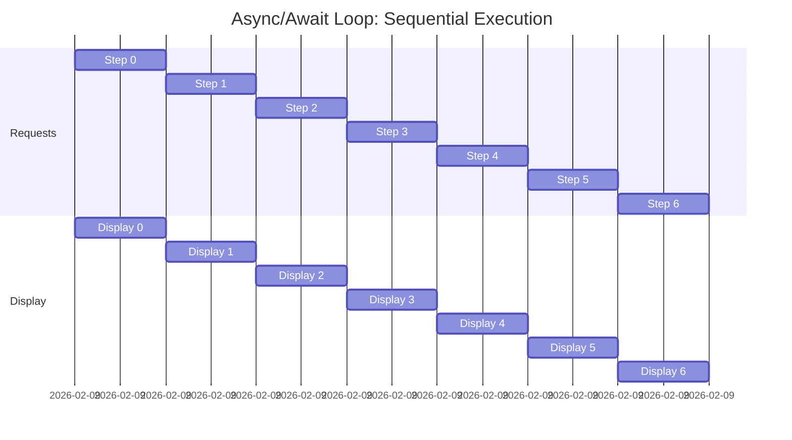
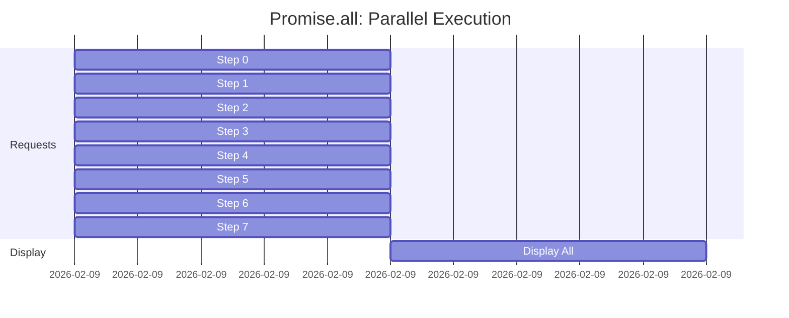

# Async JavaScript Quick Reference

## 1. Callbacks

**Idea:** Run a function *after* an async task finishes.

**Problem:** Creates deep nesting ("callback hell"). Hard to read and
maintain.

------------------------------------------------------------------------

## 2. Promises

**Idea:** A Promise is a value that will exist later.

**Pattern:**

``` javascript
getInstruction("steak", 0)
  .then(step => console.log(step))
  .catch(error => console.error(error));
```

**Key Rule:**\
Always `return` a promise inside `.then()` to keep the chain working.

**Benefit:** Flatter structure + centralized error handling.

------------------------------------------------------------------------

## 3. async / await


-   `async` → allows waiting inside the function.
-   `await` → pause THIS function until the promise resolves.
-   Does NOT freeze the browser.

**Example:**

``` javascript
async function makeSteak() {
  const step = await getInstruction("steak", 0);
  console.log(step);
}
```

**Rules:** ✅ `await` only works inside `async` functions.\
✅ Reads top → bottom (less cognitive load).

------------------------------------------------------------------------

## async + await loop reference

``` javascript
async function makeBroccoli() {
  try {
    const list = document.querySelector("#broccoli");

    for (let i = 0; i < 7; i++) {
      const step = await getInstruction("broccoli", i);
      list.innerHTML += `<li>${step}</li>`;
    }

    document.querySelector("#broccoliImg").style.display = "block";

  } catch (error) {
    console.error(error);
  }
}

makeBroccoli();
```

------------------------------------------------------------------------

## 4. Promise.all()

**Idea:** Run async tasks in parallel instead of waiting one-by-one.

**Use when tasks are independent.**

### Pattern:

1.  Create promises\
2.  Await them together\
3.  Use results

``` javascript
async function makeBroccoli() {
  const list = document.querySelector("#broccoli");

  const promises = [];
  for (let i = 0; i < 7; i++) {
    promises.push(getInstruction("broccoli", i));
  }

  const steps = await Promise.all(promises);

  steps.forEach(step => {
    list.innerHTML += `<li>${step}</li>`;
  });

  document.querySelector("#broccoliImg").style.display = "block";
}
```

### What it means:

> "Start everything → wait once → continue."

**Important:**\
If ONE promise fails → `Promise.all()` fails.

------------------------------------------------------------------------

## When to Use What

✅ **Callbacks:** Mostly legacy code.\
✅ **Promises:** Good to understand, common in APIs.\
✅ **async/await:** Default choice for readability.\
✅ **Promise.all():** Use for speed when tasks don't depend on each
other.

------------------------------------------------------------------------

## One-Line Mental Models

-   **Promise:** "I'll give you the value later."\
-   **async:** "This function can wait."\
-   **await:** "Pause here until ready."\
-   **Promise.all:** "Start all requests in parallel → wait → render when ALL are done.”

-------------------------------------------------------
## Visual Comparison: Sequential vs. Parallel

### Method 1: Promise Chain (Sequential - One at a Time)



**Total Time: ~5 seconds** (requests happen ONE AFTER ANOTHER)

### Method 2: Async/Await Loop (Sequential - One at a Time)



**Total Time: ~7 seconds** (each request waits for the previous one to complete)

### Method 3: Promise.all (PARALLEL - All at Once!)



**Total Time: ~1 second** (all requests happen SIMULTANEOUSLY)

### Quick Comparison Table

| Method | Execution | Time for 7 tasks | When to use |
|--------|-----------|------------------|------------|
| **Promise chain** | Sequential | ~1 task/sec = 7 sec | When next step depends on previous data |
| **async/await loop** | Sequential | ~1 task/sec = 7 sec | When you need to process results in order |
| **Promise.all** | Parallel | All at once = 1 sec | When tasks are independent |

**Key Insight:** Promise.all is ~7x faster for independent requests!

-------------------------------------------------------
